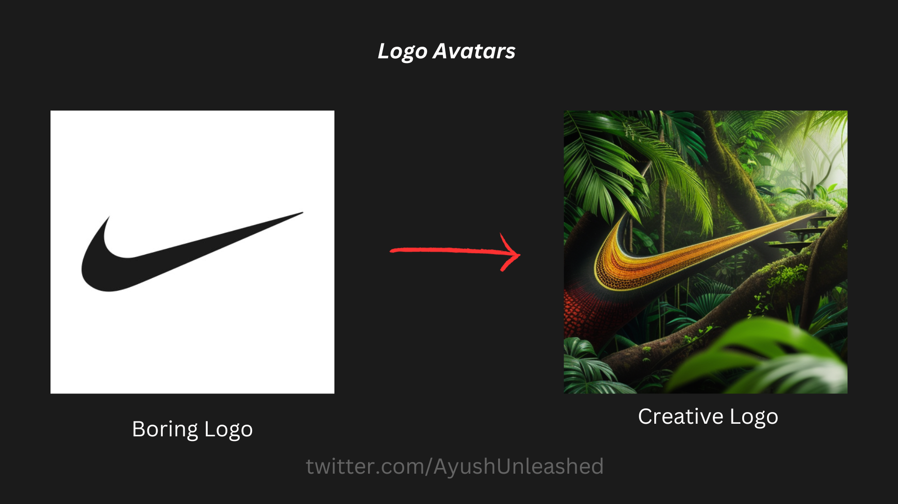

# Logo Avatars Pipeline Repository 
<a target="_blank" href="https://colab.research.google.com/github/AyushUnleashed/logo-avatars-pipeline/blob/main/Logo_avatars_notebook.ipynb">
  
</a>



## Overview
This repository contains the backend of a Stable Diffusion application, specifically designed for generating creative logos. The app utilizes Stable Diffusion version 1.5 integrated with a Control Net Canny model to transform standard logos into more creative versions.

[Streamlit Frontend Code Here](https://github.com/AyushUnleashed/logo-avatars-frontend)

## Features
- **Stable Diffusion 1.5 with Control Net Canny**: Leverages the latest in AI to generate unique logo designs.
- **FastAPI Implementation**: Built using FastAPI for efficient and scalable backend services.
- **Base64 Image Encoding**: Accepts and processes images encoded in Base64 format, streamlining the image handling process.
- **Seamless Inference Process**: Conducts inference on the decoded images and returns the creatively enhanced logos in Base64 format.

## Usage
- The FastAPI backend accepts a 'BaseSDRequest' object containing all necessary parameters.
- Images should be sent as Base64 encoded strings. These are then decoded at the backend for processing.
- After inference, the final image is re-encoded in Base64 and returned to the user.

## Google Colab Notebook
Included in the repository is a Google Colab notebook for the Logo Avatars POC. This interactive notebook allows you to run the entire process and see the results in real-time.
Just copy link of any image & run it.
[Colab Notebook](https://github.com/AyushUnleashed/logo-avatars-pipeline/blob/main/Logo_avatars_notebook.ipynb)


## API Reference

#### Check Heartbeat

```http
  GET /heartbeat
```

| Parameter | Type     | Description                       |
| :-------- | :------- | :-------------------------------- |
| `none`    | `none`   | To check if the server is running |

#### Generate Image

```http
  POST /generate_image
```

#### Parameters

| Name                           | Type     | Description                                               |
| ------------------------------ | -------- | --------------------------------------------------------- |
| `prompt`                       | `string` | **Required**. The prompt for generating the image.        |
| `encoded_control_net_image`    | `string` | **Required**. The encoded control net image in base64 format. |
| `control_type`                 | `string` | **Required**. The type of control used in image generation. |
| `height`                       | `int`    | **Required**. The height of the generated image.          |
| `width`                        | `int`    | **Required**. The width of the generated image.           |
| `controlnet_conditioning_scale`| `float`  | The scale of control net conditioning. Default is 1.0.    |
| `negative_prompt`             | `string` | A string specifying negative prompts. Default is "deformed, nsfw, blurr". |
| `base_model`                   | `string` | The base model used for generation. Default is "digiplay/Juggernaut_final". |
| `num_inference_steps`          | `int`    | The number of inference steps. Default is 20.             |
| `guidance_scale`               | `float`  | The guidance scale. Default is 0.6.                       |
| `num_images_per_prompt`        | `int`    | The number of images generated per prompt. Default is 1.  |


```json

{
  "prompt": "Colorful, jungle surrounding, trees, natural, detailed, hd, 4k, best quality, extremely detailed",
  "generated_image_encoded": "base64_encoded_generated_image_string"
}
```

# Support Me: 
[](https://www.buymeacoffee.com/ayushunleashed)
[](https://twitter.com/ayushunleashed)